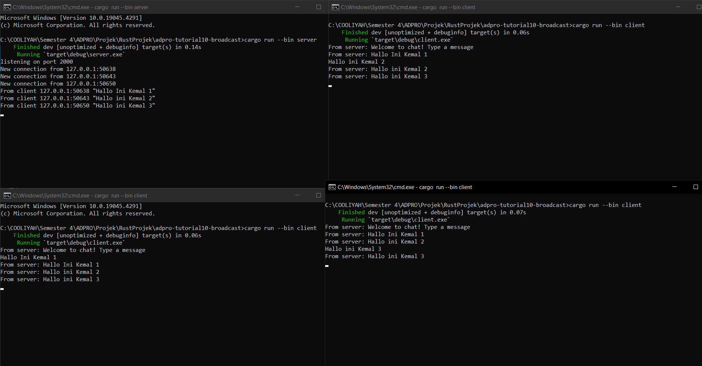
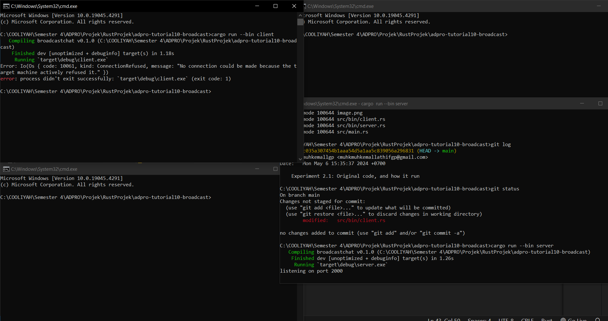
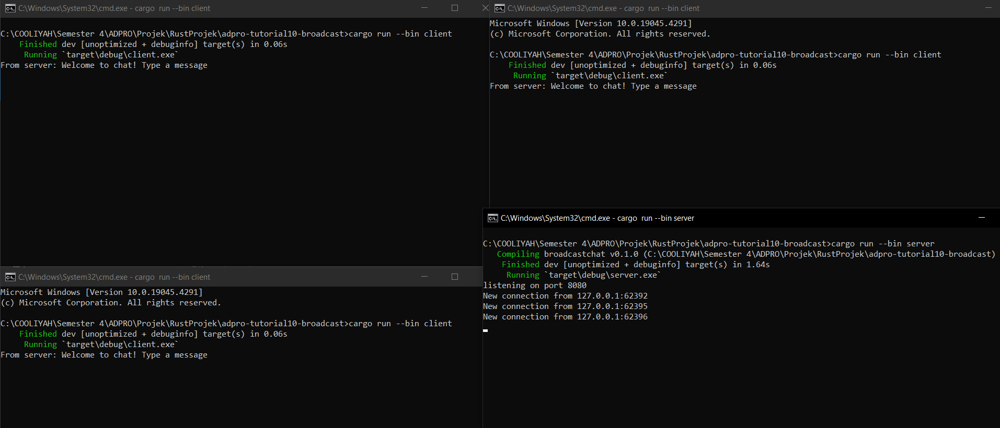
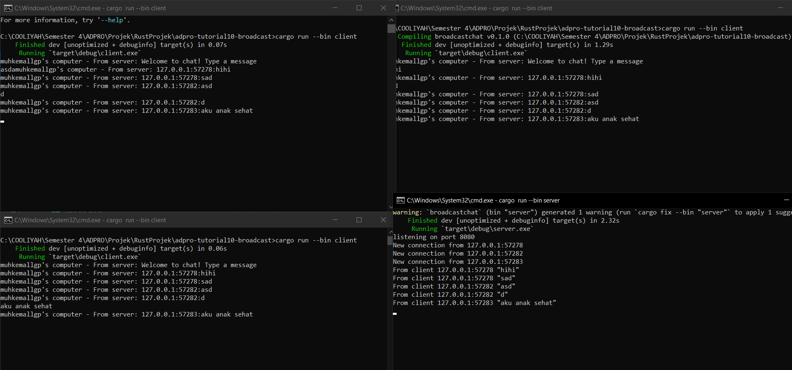
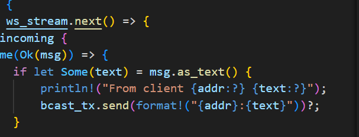

#### Nama : Muh. Kemal Lathif Galih Putra
#### NPM : 2206081225
#### Kelas : ADPRO - A
#### ASDOS : REN

# TUTORIAL - 10
## Refleksi

__2.1. Original code of broadcast chat__

- Untuk run server: `cargo run --bin server`
- Untuk run client: `cargo run --bin client`

Dari output yang terlihat, awal mula setiap client yang ter run akan terhubung ke server lalu ketika kita memberikan pesan dari satu client maka setiap klien dan server akan menerima pesan siaran dari  klien pertama yang memberikan tersebut. 

Setiap kali seorang klien memasukkan pesan melalui baris perintah, pesan tersebut akan dikirimkan ke server dan kemudian server akan meneruskannya ke semua klien yang terhubung.

__2.2: Modifying port__

Gambar diatas adalah gambar dari server dan client yang tidak memiliki port yang sama (server 2000, client 8080). Hal ini menyebabkan ketidak konekan antar server dan client sehingga koneksi tidak dapat dijalankan

Gambar diatas adalah kondisi ketika client dan server sudha berada di port yang sama yaitu 8080, dengan port yang sama ini menunjukkan bahwa client dan server dapat terkoneksi. Ini menunjukkan bahwa jika client diubah portnya maka server juga harus diubah karena ini adalah komunikasi 2 arah antar server dan client

__2.3 : Small changes, add IP and Port__

Output seperti diatas didapatkan dengan menggati satu line dalam server.rs menjadi seperti berikut:

Dengan edit kode berikut, diharapkan ketika satu client mengirimkan pesan ke server dan server mengirimkan ke semua clientnya akan dikirim jg IP dan port dari client yang mengirimkan pesan dengan variabel `addr` yang sudah dipersiapkan dalam `bcast_tx` sebgai wadah pesan yang digunakan.

